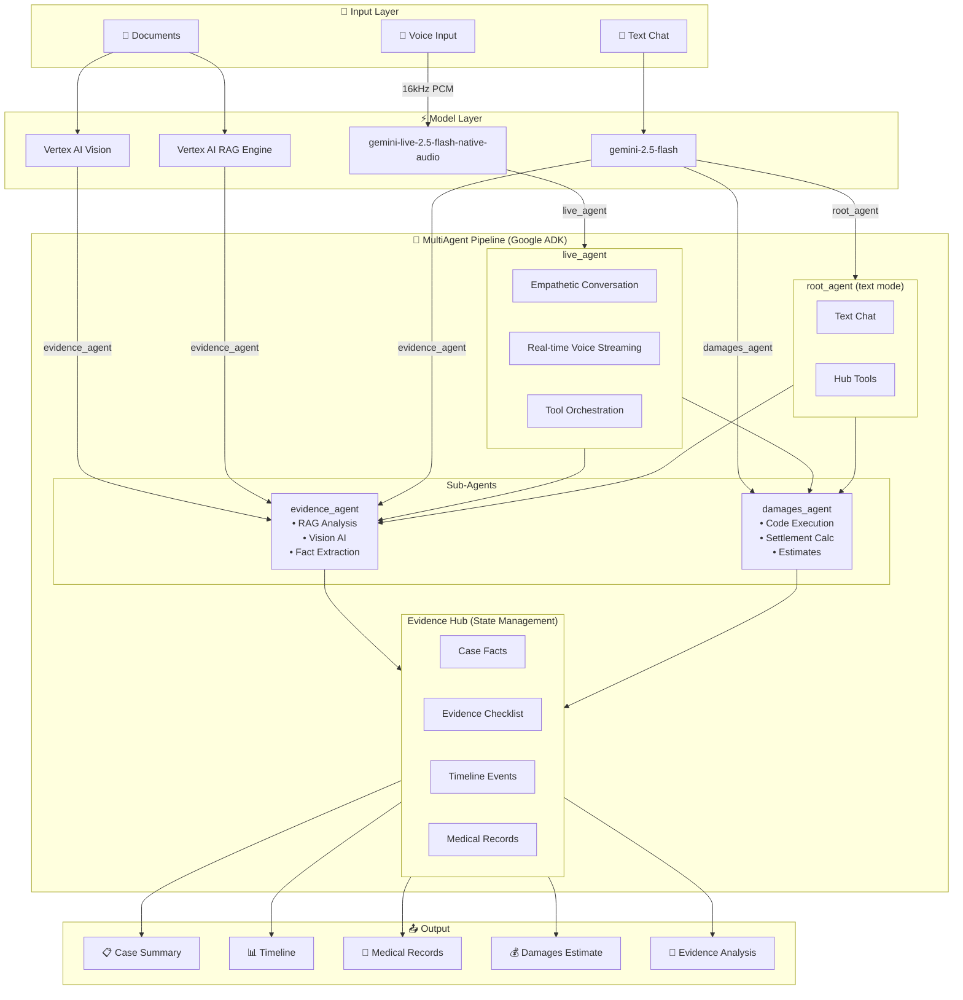
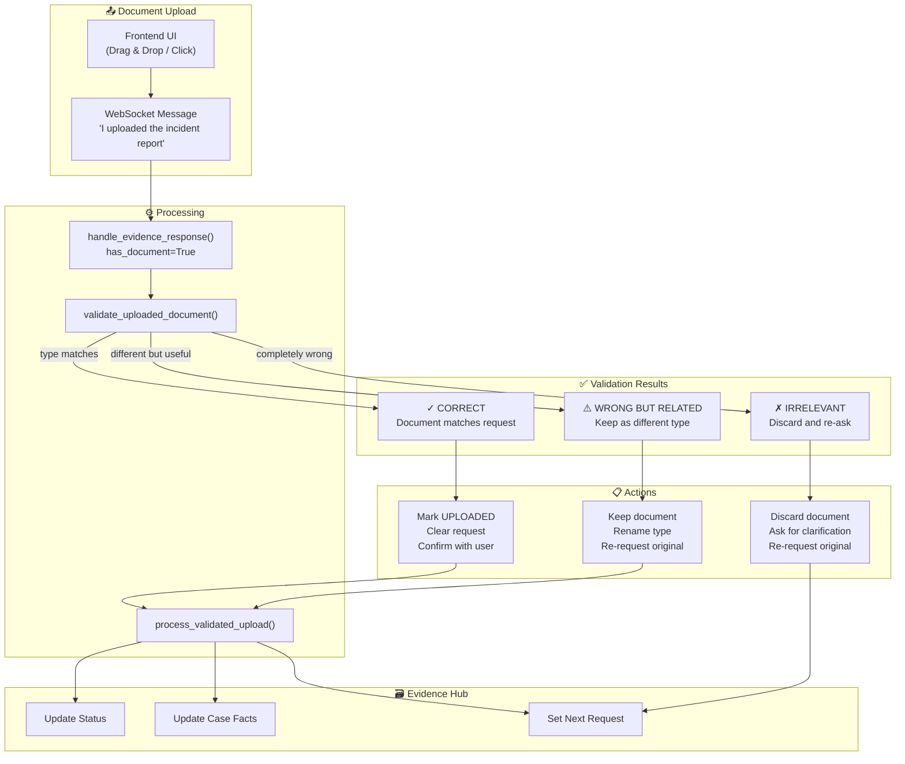
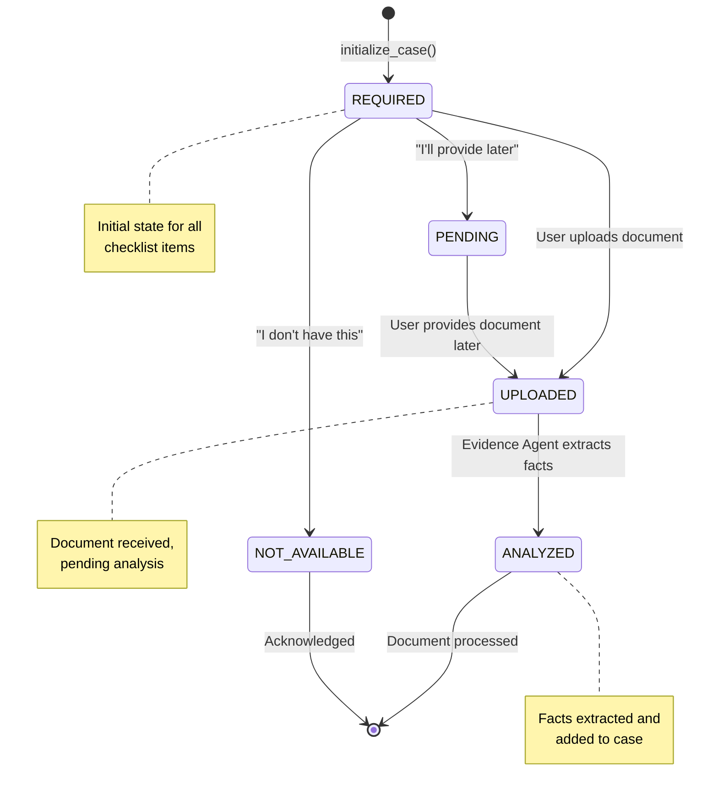
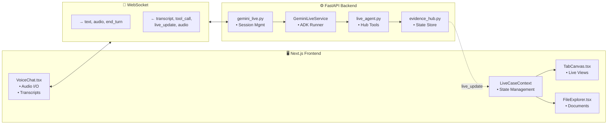
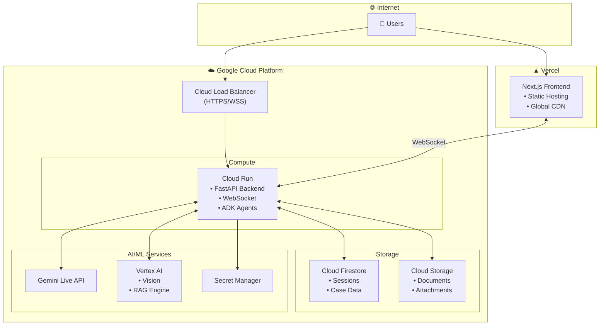
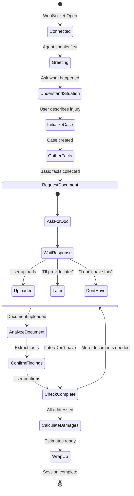

# Lexie System Architecture Diagrams

## Overview

This document contains visual representations of the Lexie AI Legal Intake System architecture. Diagrams are written in Mermaid format for easy rendering.

---

## 1. Main Multi-Agent Architecture

```
┌─────────────────────────────────────────────────────────────────────────────────────────┐
│                              LEXIE: AI LEGAL INTAKE SYSTEM                               │
└─────────────────────────────────────────────────────────────────────────────────────────┘

┌─────────────────┐                    ┌─────────────────────────────────────────────────┐
│     INPUT       │                    │           MultiAgent Pipeline (ADK)              │
├─────────────────┤                    │  ┌─────────────────────────────────────────────┐│
│ 🎤 Voice Input  │───────────────────▶│  │            LIVE AGENT (Root)                ││
│ 📄 Documents    │                    │  │                                             ││
│ 💬 Text Chat    │                    │  │  • Empathetic conversation                  ││
└─────────────────┘                    │  │  • Real-time voice streaming                ││
                                       │  │  • Interruption handling                    ││
                                       │  │  • Tool orchestration                       ││
┌─────────────────┐                    │  └────────────────┬────────────────────────────┘│
│   MODEL LAYER   │                    │                   │                             │
├─────────────────┤                    │         ┌─────────┴─────────┐                   │
│                 │                    │         ▼                   ▼                   │
│ ◆ gemini-live-  │                    │  ┌─────────────┐     ┌─────────────┐           │
│   2.5-flash-    │────────────────────┼─▶│  EVIDENCE   │     │  DAMAGES    │           │
│   native-audio  │    live_agent      │  │   AGENT     │     │   AGENT     │           │
│                 │                    │  │             │     │             │           │
│ ◆ gemini-2.5-   │                    │  │ • RAG Docs  │     │ • Code Exec │           │
│   flash         │────────────────────┼─▶│ • Vision AI │     │ • Calculate │           │
│                 │    evidence_agent  │  │ • Extract   │     │ • Estimate  │           │
│                 │    damages_agent   │  └──────┬──────┘     └──────┬──────┘           │
│                 │    root_agent      │         │                   │                   │
│                 │                    │         └─────────┬─────────┘                   │
│ ◆ Vertex AI     │                    │                   ▼                             │
│   Vision        │────────────────────┼─▶ evidence_agent (image analysis)               │
│                 │                    │                                                 │
│ ◆ Vertex AI     │                    │  ┌─────────────────────────────────────────────┐│
│   RAG Engine    │────────────────────┼─▶│           EVIDENCE HUB (State)              ││
│                 │    evidence_agent  │  │                                             ││
└─────────────────┘                    │  │  • Case Facts      • Evidence Checklist    ││
                                       │  │  • Document Status  • Session Management   ││
                                       │  │  • Timeline Events  • Damages Estimates    ││
                                       │  └─────────────────────────────────────────────┘│
                                       └─────────────────────────────────────────────────┘


                                    MODEL → AGENT MAPPING
    ┌─────────────────────────────────────────────────────────────────────────────────────┐
    │                                                                                     │
    │   MODEL                              │  AGENT              │  PURPOSE               │
    │   ───────────────────────────────────┼─────────────────────┼──────────────────────  │
    │   gemini-live-2.5-flash-native-audio │  live_agent         │  Real-time voice I/O   │
    │   gemini-2.5-flash                   │  root_agent         │  Text chat mode        │
    │   gemini-2.5-flash                   │  evidence_agent     │  Document analysis     │
    │   gemini-2.5-flash                   │  damages_agent      │  Settlement calc       │
    │   gemini-2.5-flash                   │  orchestrator_agent │  Sub-agent routing     │
    │   Vertex AI Vision                   │  evidence_agent     │  Image/photo analysis  │
    │   Vertex AI RAG Engine               │  evidence_agent     │  Document retrieval    │
    │                                                                                     │
    └─────────────────────────────────────────────────────────────────────────────────────┘
                                                              │
                                                              ▼
┌─────────────────────────────────────────────────────────────────────────────────────────┐
│                                       OUTPUT                                             │
├─────────────────┬─────────────────┬─────────────────┬─────────────────┬─────────────────┤
│  📋 Case Facts  │  📊 Timeline    │  🏥 Medical     │  💰 Damages     │  📄 Evidence    │
│                 │                 │     Records     │     Estimate    │     Analysis    │
└─────────────────┴─────────────────┴─────────────────┴─────────────────┴─────────────────┘
```

### Mermaid Version



---

## 2. Gemini Live Voice Streaming Flow (Detailed ADK Architecture)

```
┌─────────────────────────────────────────────────────────────────────────────────────────────────────────────┐
│                              GEMINI LIVE REAL-TIME VOICE STREAMING - DETAILED ADK FLOW                      │
└─────────────────────────────────────────────────────────────────────────────────────────────────────────────┘


┌─────────────────────────────────────────────────────────────────────────────────────────────────────────────┐
│                                            BACKEND (FastAPI)                                                 │
│                                                                                                             │
│  ┌─────────────────────────────────────────────────────────────────────────────────────────────────────┐    │
│  │                                    GeminiLiveService                                                │    │
│  │                                                                                                     │    │
│  │   ┌─────────────────────────────────────────────────────────────────────────────────────────────┐   │    │
│  │   │                              create_live_session(client_id)                                 │   │    │
│  │   │                                                                                             │   │    │
│  │   │  ┌──────────────────────┐   ┌──────────────────────┐   ┌────────────────────────────────┐   │   │    │
│  │   │  │       Runner         │   │ InMemorySession      │   │      LiveRequestQueue          │   │   │    │
│  │   │  │                      │   │     Service          │   │                                │   │   │    │
│  │   │  │  • agent=live_agent  │   │                      │   │  • send_realtime(Blob)         │   │   │    │
│  │   │  │  • app_name="lexie"  │   │  • create_session()  │   │  • send_content(Content)       │   │   │    │
│  │   │  │  • session_service   │   │  • store history     │   │  • close()                     │   │   │    │
│  │   │  │                      │   │                      │   │                                │   │   │    │
│  │   │  └──────────────────────┘   └──────────────────────┘   └────────────────────────────────┘   │   │    │
│  │   │                                                                                             │   │    │
│  │   └─────────────────────────────────────────────────────────────────────────────────────────────┘   │    │
│  │                                                                                                     │    │
│  │   ┌─────────────────────────────────────────────────────────────────────────────────────────────┐   │    │
│  │   │                                     RunConfig                                               │   │    │
│  │   │                                                                                             │   │    │
│  │   │  response_modalities: ["AUDIO"]                                                             │   │    │
│  │   │                                                                                             │   │    │
│  │   │  ┌─────────────────────────┐  ┌─────────────────────────┐  ┌─────────────────────────────┐  │   │    │
│  │   │  │     SpeechConfig        │  │  AudioTranscription     │  │   RealtimeInputConfig       │  │   │    │
│  │   │  │                         │  │       Config            │  │                             │  │   │    │
│  │   │  │  voice: "Puck"          │  │                         │  │  activity_handling:         │  │   │    │
│  │   │  │  language: "en-US"      │  │  • output_audio_trans   │  │    START_OF_ACTIVITY_       │  │   │    │
│  │   │  │                         │  │  • input_audio_trans    │  │      INTERRUPTS             │  │   │    │
│  │   │  │                         │  │                         │  │                             │  │   │    │
│  │   │  │                         │  │                         │  │  AutomaticActivityDetection │  │   │    │
│  │   │  │                         │  │                         │  │  • startSensitivity: HIGH   │  │   │    │
│  │   │  │                         │  │                         │  │  • endSensitivity: LOW      │  │   │    │
│  │   │  │                         │  │                         │  │  • silenceDurationMs: 500   │  │   │    │
│  │   │  └─────────────────────────┘  └─────────────────────────┘  └─────────────────────────────┘  │   │    │
│  │   │                                                                                             │   │    │
│  │   └─────────────────────────────────────────────────────────────────────────────────────────────┘   │    │
│  │                                                                                                     │    │
│  │   ┌─────────────────────────────────────────────────────────────────────────────────────────────┐   │    │
│  │   │                              run_live_session(websocket, client_id)                         │   │    │
│  │   │                                                                                             │   │    │
│  │   │         ┌─────────────────────────────────┐    ┌─────────────────────────────────┐          │   │    │
│  │   │         │   async receive_from_client()  │    │    async send_to_client()       │          │   │    │
│  │   │         │                                 │    │                                 │          │   │    │
│  │   │         │  while True:                    │    │  async for event in            │          │   │    │
│  │   │         │    data = await ws.receive()    │    │    runner.run_live(...):       │          │   │    │
│  │   │         │                                 │    │                                 │          │   │    │
│  │   │         │    if "bytes":                  │    │    if event.interrupted:       │          │   │    │
│  │   │         │      queue.send_realtime(Blob)  │    │      → send "interrupted"      │          │   │    │
│  │   │         │                                 │    │                                 │          │   │    │
│  │   │         │    if "text" msg:               │    │    if event.content:           │          │   │    │
│  │   │         │      queue.send_content()       │    │      → send audio bytes        │          │   │    │
│  │   │         │                                 │    │                                 │          │   │    │
│  │   │         │    if "audio" msg:              │    │    if event.output_transcript: │          │   │    │
│  │   │         │      queue.send_realtime(Blob)  │    │      → send transcript JSON    │          │   │    │
│  │   │         │                                 │    │                                 │          │   │    │
│  │   │         │    if "end_turn":               │    │    if event.actions:           │          │   │    │
│  │   │         │      queue.send_realtime(       │    │      → send tool_call          │          │   │    │
│  │   │         │        turn_complete=True)      │    │      → execute tool            │          │   │    │
│  │   │         │                                 │    │      → result to Gemini        │          │   │    │
│  │   │         │    if "end":                    │    │                                 │          │   │    │
│  │   │         │      queue.close()              │    │    if event.turn_complete:     │          │   │    │
│  │   │         │      return                     │    │      → send turn_complete      │          │   │    │
│  │   │         │                                 │    │      → send live_update        │          │   │    │
│  │   │         └────────────────┬────────────────┘    └────────────────┬────────────────┘          │   │    │
│  │   │                          │                                      │                          │   │    │
│  │   │                          │                                      │                          │   │    │
│  │   │                          ▼                                      ▼                          │   │    │
│  │   │         ┌────────────────────────────────────────────────────────────────────────┐          │   │    │
│  │   │         │                         turn_state (shared dict)                       │          │   │    │
│  │   │         │                                                                        │          │   │    │
│  │   │         │   user_msg_count: int   ──  Incremented on each user message           │          │   │    │
│  │   │         │   last_turn_sent: int   ──  Which msg's turn_complete was sent         │          │   │    │
│  │   │         │                                                                        │          │   │    │
│  │   │         │   Purpose: Deduplicate turn_complete events (ADK sends multiple)       │          │   │    │
│  │   │         │                                                                        │          │   │    │
│  │   │         └────────────────────────────────────────────────────────────────────────┘          │   │    │
│  │   │                                                                                             │   │    │
│  │   │                                 asyncio.gather(                                             │   │    │
│  │   │                                   receive_from_client(),                                    │   │    │
│  │   │                                   send_to_client()                                          │   │    │
│  │   │                                 )                                                           │   │    │
│  │   │                                                                                             │   │    │
│  │   └─────────────────────────────────────────────────────────────────────────────────────────────┘   │    │
│  │                                                                                                     │    │
│  └─────────────────────────────────────────────────────────────────────────────────────────────────────┘    │
│                                                                                                             │
└─────────────────────────────────────────────────────────────────────────────────────────────────────────────┘


                                           REAL-TIME DATA FLOW

    USER               FRONTEND              BACKEND                ADK                    GEMINI
                       (Next.js)             (FastAPI)              (Runner)               LIVE API
     │                    │                     │                     │                       │
     │  🎤 Speak          │                     │                     │                       │
     ├───────────────────▶│                     │                     │                       │
     │                    │ PCM Audio (16kHz)   │                     │                       │
     │                    ├────────────────────▶│                     │                       │
     │                    │ WebSocket           │ LiveRequestQueue    │                       │
     │                    │                     ├────────────────────▶│                       │
     │                    │                     │                     │ send_realtime(Blob)   │
     │                    │                     │                     ├──────────────────────▶│
     │                    │                     │                     │                       │
     │                    │                     │                     │  ◀─ Streaming ────────│
     │                    │                     │                     │     Events            │
     │                    │                     │                     │                       │
     │                    │                     │                     │ runner.run_live()     │
     │                    │                     │                     │   async for event     │
     │                    │                     │                     │                       │
     │                    │                     │  ◀─ Audio bytes ────│                       │
     │                    │                     │  ◀─ Transcripts ────│                       │
     │                    │ ◀─ WebSocket ───────│  ◀─ Tool calls ─────│                       │
     │                    │    JSON + Audio     │  ◀─ turn_complete ──│                       │
     │  🔊 Hear Response  │                     │                     │                       │
     │◀───────────────────│                     │                     │                       │
     │  📝 See Transcript │                     │                     │                       │
     │◀───────────────────│                     │                     │                       │
     │                    │                     │                     │                       │
     │  🛑 INTERRUPT!     │                     │                     │                       │
     ├───────────────────▶│                     │                     │                       │
     │                    │ turn_complete:true  │                     │                       │
     │                    ├────────────────────▶│                     │                       │
     │                    │                     │ send_realtime(      │                       │
     │                    │                     │   turn_complete=T)  │                       │
     │                    │                     ├────────────────────▶│                       │
     │                    │                     │                     ├──────────────────────▶│
     │                    │                     │                     │                       │
     │                    │                     │                     │ ◀─ event.interrupted ─│
     │                    │                     │ ◀─ "interrupted" ───│                       │
     │                    │ ◀─ {"type":         │                     │                       │
     │                    │    "interrupted"} ──│                     │                       │
     │                    │                     │                     │                       │
     │                    │ (Stop audio         │                     │                       │
     │                    │  playback)          │                     │                       │
     │                    │                     │                     │                       │
     │  📄 Upload Doc     │                     │                     │                       │
     ├───────────────────▶│                     │                     │                       │
     │                    │ {"type":"text",     │                     │                       │
     │                    │  "content":"..."}   │                     │                       │
     │                    ├────────────────────▶│                     │                       │
     │                    │                     │ send_content(       │                       │
     │                    │                     │   Content)          │                       │
     │                    │                     ├────────────────────▶│                       │
     │                    │                     │                     ├──────────────────────▶│
     │                    │                     │                     │                       │
     │                    │                     │                     │ ◀─ event.actions ─────│
     │                    │                     │                     │    (tool call)        │
     │                    │                     │                     │                       │
     │                    │                     │                     │ Execute tool:         │
     │                    │                     │                     │ handle_evidence_      │
     │                    │                     │                     │   response()          │
     │                    │                     │                     │                       │
     │                    │                     │                     │ Modify Evidence Hub   │
     │                    │                     │                     │                       │
     │                    │                     │                     │ Return result ───────▶│
     │                    │                     │                     │                       │
     │                    │                     │                     │ ◀─ Continue response ─│
     │                    │                     │                     │                       │
     │                    │                     │                     │ ◀─ event.turn_complete│
     │                    │                     │ ◀─ turn_complete ───│                       │
     │                    │                     │ ◀─ live_update ─────│                       │
     │                    │ ◀─ {"type":         │                     │                       │
     │                    │    "turn_complete"} │                     │                       │
     │                    │ ◀─ {"type":         │                     │                       │
     │                    │    "live_update",   │                     │                       │
     │                    │    "data":{...}}    │                     │                       │
     │  📊 See updated    │                     │                     │                       │
     │     case info      │                     │                     │                       │
     │◀───────────────────│                     │                     │                       │
     │                    │                     │                     │                       │


                                          ADK EVENT TYPES

    ┌─────────────────────────────────────────────────────────────────────────────────────────────────┐
    │                                                                                                 │
    │   EVENT FIELD              │  TYPE           │  DESCRIPTION                                     │
    │   ─────────────────────────┼─────────────────┼────────────────────────────────────────────────  │
    │   event.interrupted        │  bool           │  User interrupted agent (HANDLE FIRST!)         │
    │   event.content            │  Content        │  Response content with parts (audio blobs)      │
    │   event.content.parts[]    │  Part[]         │  List of parts (inline_data for audio)          │
    │   event.output_transcription│ Transcription  │  Text of agent's speech                         │
    │   event.input_transcription│  Transcription  │  Text of user's speech                          │
    │   event.turn_complete      │  bool           │  Agent finished responding                      │
    │   event.actions            │  Actions        │  Tool calls to execute                          │
    │   event.get_function_calls()│ FunctionCall[] │  Extract function calls from actions            │
    │                                                                                                 │
    └─────────────────────────────────────────────────────────────────────────────────────────────────┘


                                       TOOL EXECUTION FLOW

    ┌───────────────────────────────────────────────────────────────────────────────────────────┐
    │                                                                                           │
    │    1. Gemini decides to call tool                                                         │
    │       ↓                                                                                   │
    │    2. event.actions received in runner.run_live()                                         │
    │       ↓                                                                                   │
    │    3. ADK automatically executes tool (live_agent tools)                                  │
    │       • initialize_case()                                                                 │
    │       • update_case_facts()                                                               │
    │       • request_evidence_upload()                                                         │
    │       • handle_evidence_response()                                                        │
    │       • check_intake_complete()                                                           │
    │       ↓                                                                                   │
    │    4. Tool modifies Evidence Hub state                                                    │
    │       ↓                                                                                   │
    │    5. Tool result returned to Gemini                                                      │
    │       ↓                                                                                   │
    │    6. Gemini continues response with tool result                                          │
    │       ↓                                                                                   │
    │    7. event.turn_complete triggers live_update to frontend                                │
    │                                                                                           │
    └───────────────────────────────────────────────────────────────────────────────────────────┘
```

### Mermaid Version (Detailed)

```mermaid
sequenceDiagram
    autonumber
    participant User as 👤 User
    participant FE as 🖥️ Frontend<br/>(VoiceChat.tsx)
    participant WS as 🔌 WebSocket
    participant BE as ⚙️ FastAPI<br/>(gemini_live.py)
    participant SVC as 📦 GeminiLiveService
    participant Runner as 🏃 ADK Runner
    participant Queue as 📬 LiveRequestQueue
    participant Session as 💾 InMemorySessionService
    participant Gemini as ✨ Gemini Live API

    Note over User,Gemini: 🎬 SESSION INITIALIZATION

    FE->>WS: Connect to /api/v1/gemini-live/{client_id}
    WS->>BE: WebSocket accepted
    BE->>SVC: run_live_session(websocket, client_id)
    
    SVC->>Runner: Runner(agent=live_agent, app_name="lexie_live")
    SVC->>Session: create_session(app_name, user_id)
    Session-->>SVC: session object
    SVC->>Queue: LiveRequestQueue()
    
    Note over SVC: Reset evidence_hub for new session
    
    SVC->>SVC: asyncio.gather(<br/>receive_from_client(),<br/>send_to_client())
    
    Note over Runner,Gemini: runner.run_live() opens stream to Gemini

    Runner->>Gemini: Open bidirectional stream
    Note right of Runner: RunConfig:<br/>• response_modalities: ["AUDIO"]<br/>• voice: "Puck"<br/>• activity_handling: INTERRUPTS

    Note over User,Gemini: 🎤 VOICE INPUT FLOW

    User->>FE: Speak into microphone
    FE->>FE: AudioContext captures PCM (16kHz)
    FE->>WS: Send binary audio bytes
    WS->>BE: websocket.receive() → bytes
    BE->>Queue: send_realtime(Blob(mime="audio/pcm;rate=16000"))
    Queue->>Gemini: Stream audio to Gemini

    Note over User,Gemini: 🔊 VOICE OUTPUT FLOW

    Gemini-->>Runner: Streaming events
    
    loop async for event in runner.run_live()
        alt event.content (audio)
            Runner-->>BE: event.content.parts[].inline_data
            BE-->>WS: websocket.send_bytes(audio_data)
            WS-->>FE: Binary audio (24kHz)
            FE-->>User: Play through AudioContext 🔊
        else event.output_transcription
            Runner-->>BE: event.output_transcription.text
            BE-->>WS: {"type": "transcript", "role": "assistant", ...}
            WS-->>FE: Display transcript
        else event.input_transcription
            Runner-->>BE: event.input_transcription.text
            BE-->>WS: {"type": "transcript", "role": "user", ...}
            WS-->>FE: Display user speech
        end
    end

    Note over User,Gemini: 🔧 TOOL EXECUTION

    Gemini-->>Runner: event.actions (tool call)
    BE-->>FE: {"type": "tool_call", "tool": "initialize_case"}
    
    Note over Runner: ADK auto-executes tool
    Runner->>Runner: tool_function(**args)
    Note over Runner: Tool modifies evidence_hub
    Runner-->>Gemini: Tool result
    
    Gemini-->>Runner: Continue response with result

    Note over User,Gemini: ✅ TURN COMPLETE

    Gemini-->>Runner: event.turn_complete = True
    
    Note over BE: Check turn_state deduplication:<br/>if last_turn_sent < user_msg_count
    
    BE-->>FE: {"type": "turn_complete"}
    BE->>BE: get_live_data_snapshot()
    BE-->>FE: {"type": "live_update", "data": {...}}
    FE->>FE: Update LiveCaseContext

    Note over User,Gemini: 🛑 USER INTERRUPTION

    User->>FE: Start speaking (interrupt)
    FE->>WS: Audio bytes
    
    Note over Gemini: VAD detects speech<br/>startSensitivity: HIGH
    
    Gemini-->>Runner: event.interrupted = True
    BE-->>FE: {"type": "interrupted"}
    FE->>FE: Stop audio playback immediately
    FE->>FE: Clear audio queue

    Note over User,Gemini: 📤 TEXT MESSAGE (Alternative)

    User->>FE: Type message / Upload doc response
    FE->>WS: {"type": "text", "content": "I uploaded the report"}
    WS->>BE: JSON message
    BE->>BE: turn_state["user_msg_count"] += 1
    BE->>Queue: send_content(Content(role="user", parts=[text]))
    Queue->>Gemini: Text input

    Note over User,Gemini: 🔚 SESSION END

    FE->>WS: {"type": "end"}
    WS->>BE: End message
    BE->>Queue: close()
    BE->>SVC: Cleanup session
    SVC->>Session: Remove session
```

### Component Responsibilities

```
┌─────────────────────────────────────────────────────────────────────────────────────────────────┐
│                                    ADK COMPONENT RESPONSIBILITIES                                │
└─────────────────────────────────────────────────────────────────────────────────────────────────┘

┌─────────────────────────────┐
│          Runner             │
├─────────────────────────────┤
│ • Manages agent lifecycle   │
│ • Orchestrates run_live()   │
│ • Routes events from Gemini │
│ • Auto-executes tools       │
│ • Manages conversation turn │
└─────────────────────────────┘

┌─────────────────────────────┐
│   InMemorySessionService    │
├─────────────────────────────┤
│ • Creates/stores sessions   │
│ • Maintains conversation    │
│   history per user          │
│ • Provides session context  │
│   to runner                 │
└─────────────────────────────┘

┌─────────────────────────────┐
│     LiveRequestQueue        │
├─────────────────────────────┤
│ • Buffers upstream messages │
│ • send_realtime(Blob)       │
│   → Audio bytes             │
│ • send_content(Content)     │
│   → Text messages           │
│ • send_realtime(turn=True)  │
│   → End of user turn        │
│ • close() → End session     │
└─────────────────────────────┘

┌─────────────────────────────┐
│         RunConfig           │
├─────────────────────────────┤
│ • response_modalities       │
│   ["AUDIO"] for voice       │
│ • SpeechConfig              │
│   - voice: "Puck"           │
│   - language: "en-US"       │
│ • AudioTranscriptionConfig  │
│   - Enable transcripts      │
│ • RealtimeInputConfig       │
│   - Interruption handling   │
│   - VAD sensitivity         │
└─────────────────────────────┘

┌─────────────────────────────┐
│       live_agent            │
├─────────────────────────────┤
│ • Model: gemini-2.5-flash-  │
│   preview-native-audio      │
│ • Tools: HUB_TOOLS          │
│ • System instruction        │
│ • Handles intake flow       │
└─────────────────────────────┘
```

---

## 3. Document Processing Pipeline

```
┌─────────────────────────────────────────────────────────────────────────────────────────┐
│                           DOCUMENT PROCESSING PIPELINE                                   │
└─────────────────────────────────────────────────────────────────────────────────────────┘

  📄 Document Upload                                                         
        │                                                                    
        ▼                                                                    
┌───────────────────┐                                                        
│  Frontend Upload  │                                                        
│  (Drag & Drop)    │                                                        
└────────┬──────────┘                                                        
         │                                                                   
         ▼                                                                   
┌───────────────────┐     ┌───────────────────┐     ┌───────────────────┐   
│  handle_evidence  │────▶│    Validation     │────▶│  Process Upload   │   
│    _response()    │     │                   │     │                   │   
│                   │     │  • Type match?    │     │  • Mark UPLOADED  │   
│  has_document=T   │     │  • Related?       │     │  • Clear request  │   
└───────────────────┘     │  • Irrelevant?    │     │  • Update facts   │   
                          └────────┬──────────┘     └────────┬──────────┘   
                                   │                         │              
                    ┌──────────────┼──────────────┐          │              
                    ▼              ▼              ▼          │              
             ┌──────────┐   ┌──────────┐   ┌──────────┐      │              
             │ CORRECT  │   │  WRONG   │   │  WRONG   │      │              
             │          │   │  BUT     │   │  IRRELE- │      │              
             │  Accept  │   │ RELATED  │   │  VANT    │      │              
             │  & Next  │   │          │   │          │      │              
             └────┬─────┘   │  Keep +  │   │  Discard │      │              
                  │         │ Re-ask   │   │  & Ask   │      │              
                  │         └────┬─────┘   └────┬─────┘      │              
                  │              │              │            │              
                  └──────────────┴──────────────┘            │              
                                   │                         │              
                                   ▼                         ▼              
                          ┌───────────────────────────────────────┐         
                          │           EVIDENCE HUB                │         
                          │                                       │         
                          │  Update Status:                       │         
                          │  • REQUIRED → UPLOADED                │         
                          │  • Set next document request          │         
                          │  • Update case facts                  │         
                          └───────────────────────────────────────┘         
```

### Mermaid Version



---

## 4. Evidence Collection State Machine

```
┌─────────────────────────────────────────────────────────────────────────────────────────┐
│                         EVIDENCE ITEM STATE MACHINE                                      │
└─────────────────────────────────────────────────────────────────────────────────────────┘

                              ┌─────────────┐
                              │   REQUIRED  │ ◀──── Initial state
                              │   (start)   │
                              └──────┬──────┘
                                     │
              ┌──────────────────────┼──────────────────────┐
              │                      │                      │
              ▼                      ▼                      ▼
    ┌─────────────────┐    ┌─────────────────┐    ┌─────────────────┐
    │     PENDING     │    │    UPLOADED     │    │  NOT_AVAILABLE  │
    │                 │    │                 │    │                 │
    │ "I'll provide   │    │ User uploaded   │    │  "I don't have  │
    │  later"         │    │ the document    │    │   this"         │
    └────────┬────────┘    └────────┬────────┘    └─────────────────┘
             │                      │                      
             │                      ▼                      
             │             ┌─────────────────┐             
             │             │    ANALYZED     │             
             │             │                 │             
             │             │ Agent extracted │             
             │             │ facts from doc  │             
             │             └─────────────────┘             
             │                                             
             │         ┌─────────────────────────────┐     
             └────────▶│       Back to UPLOADED      │     
                       │   (when user provides doc)  │     
                       └─────────────────────────────┘     


                    STATE TRANSITIONS
    ┌──────────────────────────────────────────────────────┐
    │  REQUIRED ──▶ PENDING       : "I'll provide later"   │
    │  REQUIRED ──▶ UPLOADED      : User uploads file      │
    │  REQUIRED ──▶ NOT_AVAILABLE : "I don't have this"    │
    │  PENDING  ──▶ UPLOADED      : User provides doc      │
    │  UPLOADED ──▶ ANALYZED      : Agent extracts facts   │
    └──────────────────────────────────────────────────────┘
```

### Mermaid Version



---

## 5. Frontend-Backend Communication

```
┌─────────────────────────────────────────────────────────────────────────────────────────┐
│                      FRONTEND ◀──── WebSocket ────▶ BACKEND                              │
└─────────────────────────────────────────────────────────────────────────────────────────┘

┌─────────────────────────────────┐              ┌─────────────────────────────────────┐
│         NEXT.JS FRONTEND        │              │          FASTAPI BACKEND            │
│                                 │              │                                     │
│  ┌───────────────────────────┐  │              │  ┌─────────────────────────────────┐│
│  │      VoiceChat.tsx        │  │              │  │      gemini_live.py             ││
│  │                           │  │              │  │                                 ││
│  │  • Audio capture          │  │   WebSocket  │  │  • Session management           ││
│  │  • Audio playback         │◀─┼──────────────┼─▶│  • ADK Runner                   ││
│  │  • Transcript display     │  │              │  │  • Tool execution               ││
│  │  • Document cards         │  │              │  │  • Live updates                 ││
│  └───────────────────────────┘  │              │  └─────────────────────────────────┘│
│                                 │              │                                     │
│  ┌───────────────────────────┐  │              │  ┌─────────────────────────────────┐│
│  │    LiveCaseContext.tsx    │  │              │  │      evidence_hub.py            ││
│  │                           │  │   live_      │  │                                 ││
│  │  • Case facts state       │◀─┼───update─────┼──│  • Case facts                   ││
│  │  • Evidence items         │  │              │  │  • Evidence checklist           ││
│  │  • Timeline events        │  │              │  │  • Document tracking            ││
│  │  • Medical records        │  │              │  │  • Session state                ││
│  │  • Damages estimates      │  │              │  └─────────────────────────────────┘│
│  └───────────────────────────┘  │              │                                     │
│                                 │              │  ┌─────────────────────────────────┐│
│  ┌───────────────────────────┐  │              │  │      live_agent.py              ││
│  │      TabCanvas.tsx        │  │              │  │                                 ││
│  │                           │  │              │  │  HUB TOOLS:                     ││
│  │  Live Views:              │  │              │  │  • initialize_case              ││
│  │  • LiveCaseSummaryView    │  │              │  │  • update_case_facts            ││
│  │  • LiveTimelineView       │  │              │  │  • request_evidence_upload      ││
│  │  • LiveEvidenceView       │  │              │  │  • handle_evidence_response     ││
│  │  • LiveMedicalView        │  │              │  │  • check_intake_complete        ││
│  │  • LiveDamagesView        │  │              │  │  • get_case_summary             ││
│  └───────────────────────────┘  │              │  └─────────────────────────────────┘│
│                                 │              │                                     │
│  ┌───────────────────────────┐  │              │                                     │
│  │     FileExplorer.tsx      │  │              │                                     │
│  │                           │  │              │                                     │
│  │  • Uploaded files         │  │              │                                     │
│  │  • Processing status      │  │              │                                     │
│  │  • File preview           │  │              │                                     │
│  └───────────────────────────┘  │              │                                     │
└─────────────────────────────────┘              └─────────────────────────────────────┘


              WEBSOCKET MESSAGE TYPES
    ┌─────────────────────────────────────────────────────────────┐
    │  FRONTEND → BACKEND                                         │
    │  ─────────────────                                          │
    │  • {"type": "text", "content": "..."}     Text message      │
    │  • {"type": "audio", "data": "base64..."}  Audio chunk      │
    │  • {"type": "end_turn"}                   End of speech     │
    │  • {"type": "end"}                        Close session     │
    │                                                             │
    │  BACKEND → FRONTEND                                         │
    │  ─────────────────                                          │
    │  • {"type": "connected"}                  Session ready     │
    │  • {"type": "transcript", ...}            Speech text       │
    │  • {"type": "tool_call", ...}             Tool executing    │
    │  • {"type": "turn_complete"}              Response done     │
    │  • {"type": "live_update", "data": {...}} State snapshot    │
    │  • {"type": "interrupted"}                User interrupted  │
    │  • {"type": "error", ...}                 Error occurred    │
    │  • [binary data]                          Audio bytes       │
    └─────────────────────────────────────────────────────────────┘
```

### Mermaid Version



---

## 6. Cloud Deployment Architecture (Future)

```
┌─────────────────────────────────────────────────────────────────────────────────────────┐
│                      GOOGLE CLOUD PLATFORM DEPLOYMENT                                    │
└─────────────────────────────────────────────────────────────────────────────────────────┘

┌─────────────────────────────────────────────────────────────────────────────────────────┐
│                                    INTERNET                                              │
└───────────────────────────────────────┬─────────────────────────────────────────────────┘
                                        │
                                        ▼
                          ┌─────────────────────────────┐
                          │     Cloud Load Balancer     │
                          │        (HTTPS/WSS)          │
                          └──────────────┬──────────────┘
                                         │
                    ┌────────────────────┴────────────────────┐
                    │                                         │
                    ▼                                         ▼
    ┌───────────────────────────────┐       ┌───────────────────────────────┐
    │        Cloud Run              │       │         Vercel                 │
    │     (Backend Service)         │       │     (Frontend Hosting)         │
    │                               │       │                               │
    │  ┌─────────────────────────┐  │       │  ┌─────────────────────────┐  │
    │  │      FastAPI App        │  │       │  │      Next.js App        │  │
    │  │                         │  │       │  │                         │  │
    │  │  • WebSocket endpoint   │  │       │  │  • Static pages         │  │
    │  │  • Gemini Live Service  │  │       │  │  • React components     │  │
    │  │  • Evidence Hub         │  │       │  │  • WebSocket client     │  │
    │  │  • Agent orchestration  │  │       │  │                         │  │
    │  └─────────────────────────┘  │       │  └─────────────────────────┘  │
    │                               │       │                               │
    │  Auto-scaling: 0-10 instances │       │  Global CDN                   │
    │  Memory: 2GB+ (for ADK)       │       │  Edge caching                 │
    └───────────────┬───────────────┘       └───────────────────────────────┘
                    │
        ┌───────────┴───────────────────────────────────────┐
        │                                                   │
        ▼                                                   ▼
┌───────────────────────┐                   ┌───────────────────────────────┐
│    Cloud Firestore    │                   │      Google Cloud APIs        │
│   (Session Storage)   │                   │                               │
│                       │                   │  ┌─────────────────────────┐  │
│  • Case data          │                   │  │  Gemini Live API        │  │
│  • Evidence metadata  │                   │  │  (Real-time voice)      │  │
│  • User sessions      │                   │  └─────────────────────────┘  │
│  • Conversation logs  │                   │                               │
│                       │                   │  ┌─────────────────────────┐  │
└───────────────────────┘                   │  │  Vertex AI              │  │
                                            │  │  • Vision API           │  │
┌───────────────────────┐                   │  │  • RAG Engine           │  │
│   Cloud Storage       │                   │  │  • Embeddings           │  │
│  (Document Storage)   │                   │  └─────────────────────────┘  │
│                       │                   │                               │
│  • Uploaded documents │                   │  ┌─────────────────────────┐  │
│  • Processed files    │                   │  │  Secret Manager         │  │
│  • Case attachments   │                   │  │  (API Keys)             │  │
│                       │                   │  └─────────────────────────┘  │
└───────────────────────┘                   └───────────────────────────────┘


                    ENVIRONMENT VARIABLES
    ┌─────────────────────────────────────────────────────────────┐
    │  GOOGLE_CLOUD_PROJECT      : Project ID                     │
    │  GOOGLE_CLOUD_REGION       : us-central1                    │
    │  GOOGLE_APPLICATION_CREDS  : Service account (auto in GCP)  │
    │  CORS_ORIGINS              : Frontend domains               │
    │  LOG_LEVEL                 : INFO                           │
    └─────────────────────────────────────────────────────────────┘
```

### Mermaid Version



---

## 7. Intake Flow State Diagram

```
┌─────────────────────────────────────────────────────────────────────────────────────────┐
│                           INTAKE CONVERSATION FLOW                                       │
└─────────────────────────────────────────────────────────────────────────────────────────┘

    ┌──────────────────┐
    │      START       │
    │   (Connected)    │
    └────────┬─────────┘
             │
             ▼
    ┌──────────────────┐
    │    GREETING      │
    │                  │
    │ "Hello, I'm      │
    │  Lexie..."       │
    └────────┬─────────┘
             │
             ▼
    ┌──────────────────┐                              ┌──────────────────┐
    │  UNDERSTAND      │                              │   INITIALIZE     │
    │  SITUATION       │─────────────────────────────▶│      CASE        │
    │                  │  User describes injury       │                  │
    │ "What happened?" │                              │ initialize_case()│
    └────────┬─────────┘                              └────────┬─────────┘
             │                                                 │
             │◀────────────────────────────────────────────────┘
             │
             ▼
    ┌──────────────────┐
    │  GATHER FACTS    │───────────────────┐
    │                  │                   │
    │ "When/where?"    │                   │  update_case_facts()
    │ "What injuries?" │                   │
    └────────┬─────────┘                   │
             │                             │
             ▼                             │
    ┌──────────────────┐                   │
    │ REQUEST DOCUMENT │◀──────────────────┘
    │                  │
    │ request_evidence │
    │    _upload()     │
    │                  │
    │ "Do you have X?" │
    └────────┬─────────┘
             │
    ┌────────┴────────────────────────────┐
    │                │                    │
    ▼                ▼                    ▼
┌────────┐     ┌──────────┐        ┌──────────┐
│UPLOADED│     │  LATER   │        │DON'T HAVE│
│        │     │          │        │          │
│handle_ │     │ handle_  │        │ handle_  │
│evidence│     │ evidence │        │ evidence │
│_resp() │     │ _resp()  │        │ _resp()  │
└───┬────┘     └────┬─────┘        └────┬─────┘
    │               │                   │
    ▼               │                   │
┌──────────┐        │                   │
│ ANALYZE  │        │                   │
│ DOCUMENT │        │                   │
│          │        │                   │
│ "I see   │        │                   │
│  from    │        │                   │
│  the     │        │                   │
│  report  │        │                   │
│  that..."│        │                   │
└───┬──────┘        │                   │
    │               │                   │
    ▼               │                   │
┌──────────┐        │                   │
│ CONFIRM  │        │                   │
│ FINDINGS │        │                   │
│          │        │                   │
│ "Is that │        │                   │
│  correct?│        │                   │
└───┬──────┘        │                   │
    │               │                   │
    └───────────────┴───────────────────┘
             │
             ▼
    ┌──────────────────┐
    │ CHECK COMPLETE   │
    │                  │
    │ check_intake_    │──────────▶ More items? ──▶ REQUEST DOCUMENT
    │    complete()    │                │
    └────────┬─────────┘                │
             │                          │
             │  ◀───────────────────────┘
             │  All items addressed
             ▼
    ┌──────────────────┐
    │  CALCULATE       │
    │  DAMAGES         │
    │                  │
    │  damages_agent   │
    └────────┬─────────┘
             │
             ▼
    ┌──────────────────┐
    │  WRAP UP         │
    │                  │
    │ get_case_        │
    │    summary()     │
    │                  │
    │ "Here's what     │
    │  we have..."     │
    └────────┬─────────┘
             │
             ▼
    ┌──────────────────┐
    │      END         │
    │                  │
    │ Session complete │
    └──────────────────┘
```

### Mermaid Version



---

## 8. Tool Dependencies & Data Flow

```
┌─────────────────────────────────────────────────────────────────────────────────────────┐
│                              HUB TOOLS DEPENDENCY GRAPH                                  │
└─────────────────────────────────────────────────────────────────────────────────────────┘

    ┌─────────────────────────────────────────────────────────────────────────────────────┐
    │                                LIVE AGENT TOOLS                                      │
    └─────────────────────────────────────────────────────────────────────────────────────┘
    
          ┌────────────────────┐
          │   initialize_case  │◀──────── MUST call first (creates checklist)
          └──────────┬─────────┘
                     │
                     │  sets up
                     ▼
    ┌────────────────────────────────────────────────────────────────┐
    │                       EVIDENCE HUB STATE                        │
    │                                                                │
    │   ┌──────────────┐  ┌──────────────┐  ┌──────────────────────┐ │
    │   │  checklist   │  │    facts     │  │ currently_requested  │ │
    │   │  (13 items)  │  │  (CaseFacts) │  │   (EvidenceItem)     │ │
    │   └──────────────┘  └──────────────┘  └──────────────────────┘ │
    │                                                                │
    └────────────────────────────────────────────────────────────────┘
                     │
        ┌────────────┼────────────────────────────────┐
        │            │                                │
        ▼            ▼                                ▼
┌───────────────┐ ┌───────────────────────┐ ┌────────────────────┐
│update_case_   │ │request_evidence_      │ │get_evidence_       │
│   facts()     │ │     upload()          │ │   checklist()      │
│               │ │                       │ │                    │
│ Writes to     │ │ Sets currently_       │ │ Reads checklist    │
│ facts dict    │ │ requested item        │ │ status             │
│               │ │ (shows UI card)       │ │                    │
└───────────────┘ └───────────┬───────────┘ └────────────────────┘
                              │
                              │ triggers
                              ▼
                  ┌───────────────────────┐
                  │handle_evidence_       │
                  │     response()        │
                  │                       │
                  │ • Updates item status │
                  │ • Clears current req  │
                  │ • Returns next steps  │
                  └───────────┬───────────┘
                              │
              ┌───────────────┼───────────────┐
              │               │               │
              ▼               ▼               ▼
    ┌──────────────┐ ┌──────────────┐ ┌──────────────┐
    │  validate_   │ │    mark_     │ │    mark_     │
    │  uploaded_   │ │  evidence_   │ │  evidence_   │
    │  document()  │ │   pending()  │ │not_available │
    │              │ │              │ │     ()       │
    │  Checks if   │ │  "I'll       │ │  "I don't    │
    │  doc matches │ │   provide    │ │   have       │
    │  request     │ │   later"     │ │   this"      │
    └──────┬───────┘ └──────────────┘ └──────────────┘
           │
           ▼
    ┌──────────────┐
    │  process_    │
    │  validated_  │
    │   upload()   │
    │              │
    │ • Accept     │
    │ • Keep+rename│
    │ • Discard    │
    └──────┬───────┘
           │
           ▼
    ┌───────────────────────┐          ┌────────────────────┐
    │ check_intake_         │─────────▶│   get_case_        │
    │      complete()       │          │     summary()      │
    │                       │ complete │                    │
    │ Checks if all items   │─────────▶│ Generates final    │
    │ have been addressed   │          │ case summary       │
    └───────────────────────┘          └────────────────────┘
```

---

## Quick Reference: Message Types

| Direction | Type | Purpose |
|-----------|------|---------|
| FE → BE | `text` | User text message |
| FE → BE | `audio` | Audio PCM chunk |
| FE → BE | `end_turn` | User finished speaking |
| FE → BE | `end` | Close session |
| BE → FE | `connected` | Session established |
| BE → FE | `transcript` | Speech transcription |
| BE → FE | `tool_call` | Tool being executed |
| BE → FE | `turn_complete` | Agent finished response |
| BE → FE | `live_update` | State snapshot |
| BE → FE | `interrupted` | User interrupted agent |
| BE → FE | `error` | Error occurred |
| BE → FE | (binary) | Audio output bytes |

---

## Quick Reference: Evidence States

| State | Meaning | Triggered By |
|-------|---------|--------------|
| `REQUIRED` | Initial state, document needed | `initialize_case()` |
| `PENDING` | User will provide later | "I'll provide later" |
| `UPLOADED` | Document received | User uploads file |
| `ANALYZED` | Facts extracted | Evidence Agent |
| `NOT_AVAILABLE` | User doesn't have it | "I don't have this" |

---

*Generated for Lexie AI Legal Intake System*
